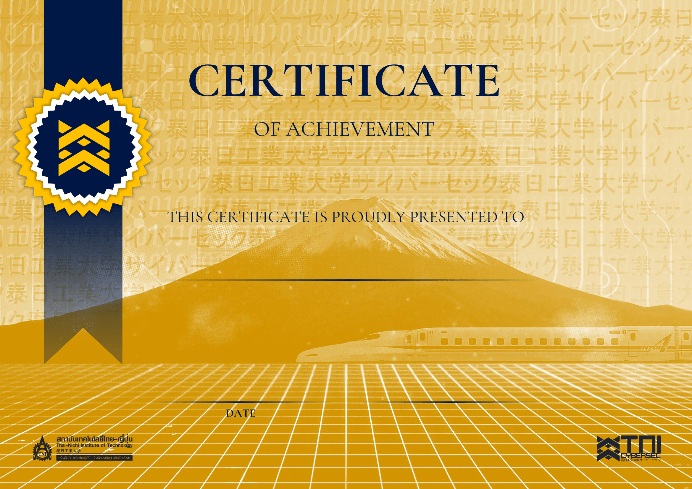

# Certgen

**Certgen** is a simple mass certificate generator, written in Python.

## Usage

### Prerequisite

- Install dependencies

```sh
$ pip install -r requirements.txt
```

- Prepare `names.txt`, _one name per line_.

### Run

```sh
$ python certgen.py
```

## Example

|            Template             |                        Output                         |
| :-----------------------------: | :---------------------------------------------------: |
|  |  |

## License

Licensed under the [MIT license](LICENSE).
